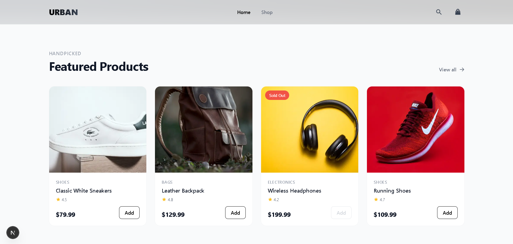
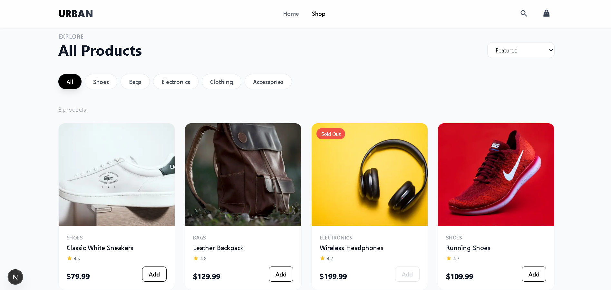

# Urban Cart – Modern Ecommerce Storefront

A fully custom, frontend‑only ecommerce store built with Next.js, TypeScript, and Tailwind CSS.  
It's a complete shopping experience: product catalogue, category filtering, cart with localStorage, and a mock checkout flow.

I built this as the second piece of my portfolio to show that I don't need a pre‑built platform
to create a professional online store. Everything here is hand‑coded – the product data, the cart logic,
the UI components, and the checkout simulation.

---

## ✨ What it does

- **Product catalogue** – 8 products across multiple categories (shoes, bags, electronics, clothing, accessories).
- **Category filtering & sorting** – filter by category, sort by price or rating.
- **Product detail pages** – image gallery, description, ratings, add‑to‑cart button.
- **Full shopping cart** – add, remove, update quantities, all saved in `localStorage` so it survives refreshes.
- **Mock checkout** – a realistic payment form that simulates placing an order (no real payment processing, but it looks and feels like the real thing).
- **Responsive design** – works on mobile, tablet, and desktop without hiccups.
- **Subtle animations** – page transitions, hover effects, and scroll‑triggered reveals that make the store feel polished.

---

## 🧰 Tech Stack

- **Next.js 14** – Pages Router, client‑side navigation
- **TypeScript** – strict mode, fully typed
- **Tailwind CSS v3** – utility‑first styling, custom components via `@layer`
- **Framer Motion** – smooth page animations and layout transitions
- **React Icons** – crisp SVG icons throughout
- **React Hot Toast** – toast notifications for cart actions
- **localStorage** – cart persistence without a backend

---

## 🎥 Live Demo

👉 **[https://your-demo-link.vercel.app](https://your-demo-link.vercel.app)**

## 📸 Screenshots

**
**

## 🚀 Getting Started

1. **Clone the repository**
   ```bash
   git clone https://github.com/YOUR_USERNAME/urban-cart.git
   cd urban-cart
